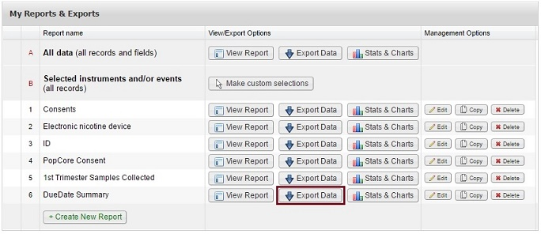
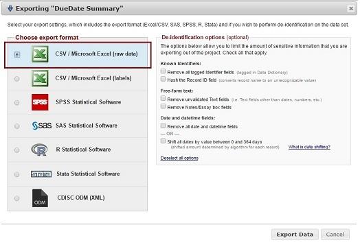

### RedCap

Please log in your redCap account, go to "Data Exports, Reports, and Stats" under Applications on the left panel, and download the report named "DueDate Summary" as shown in the pictures below. 
  
Then choose the "CSV/Microsoft Excel (raw data)" as the format of the export (shown below)  
  

***
### Due date and trimester window definition
The expected due date of a participant was acquired from her questionnaires. The duration of a pregnancy is 40w0d.  
